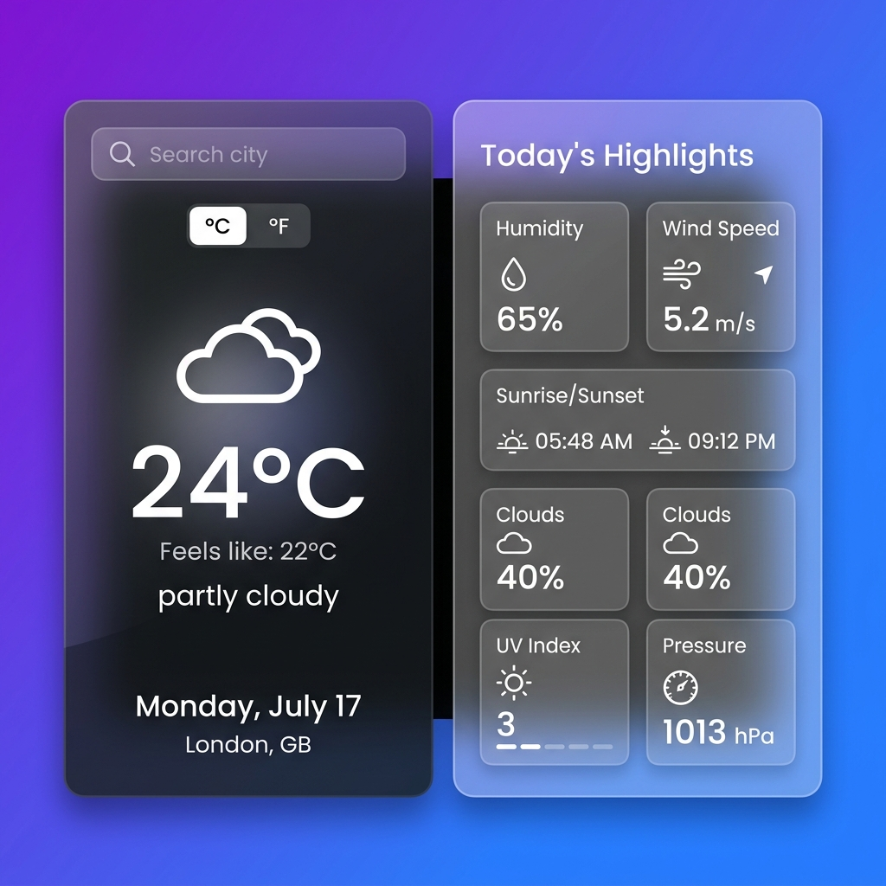
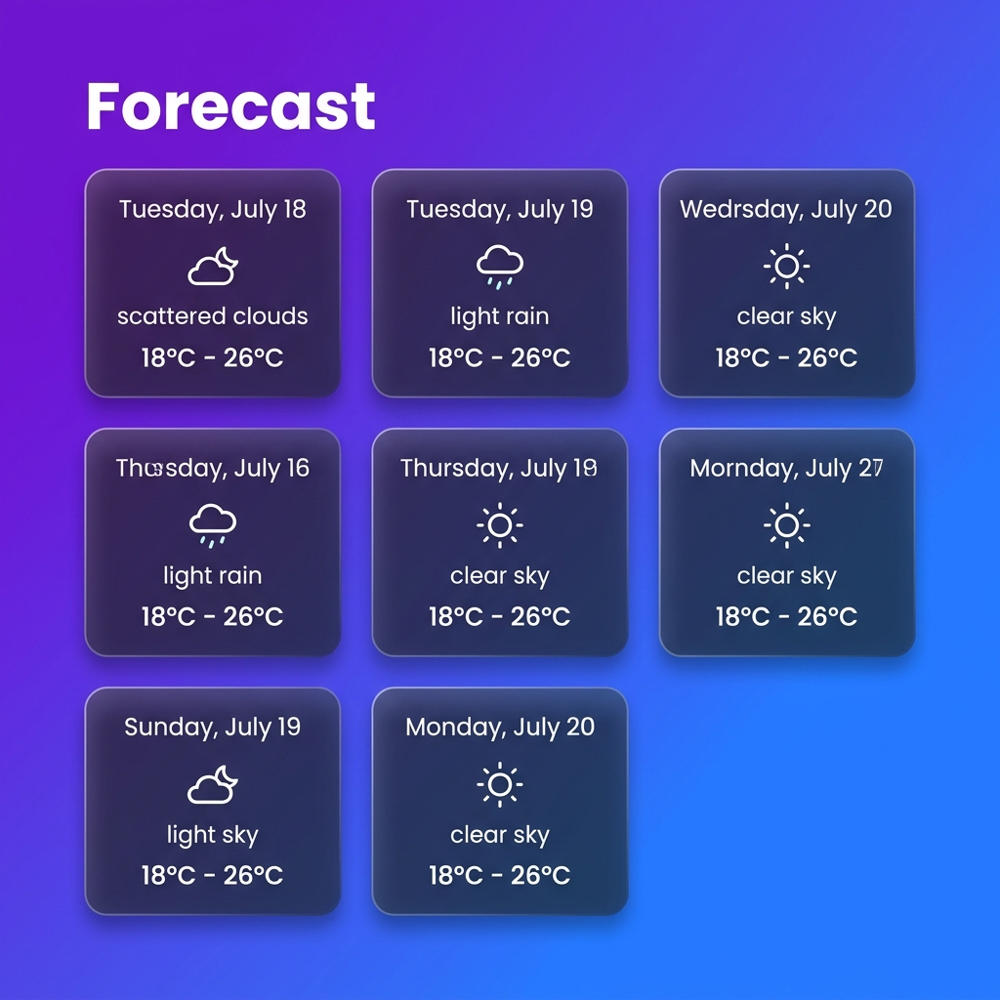
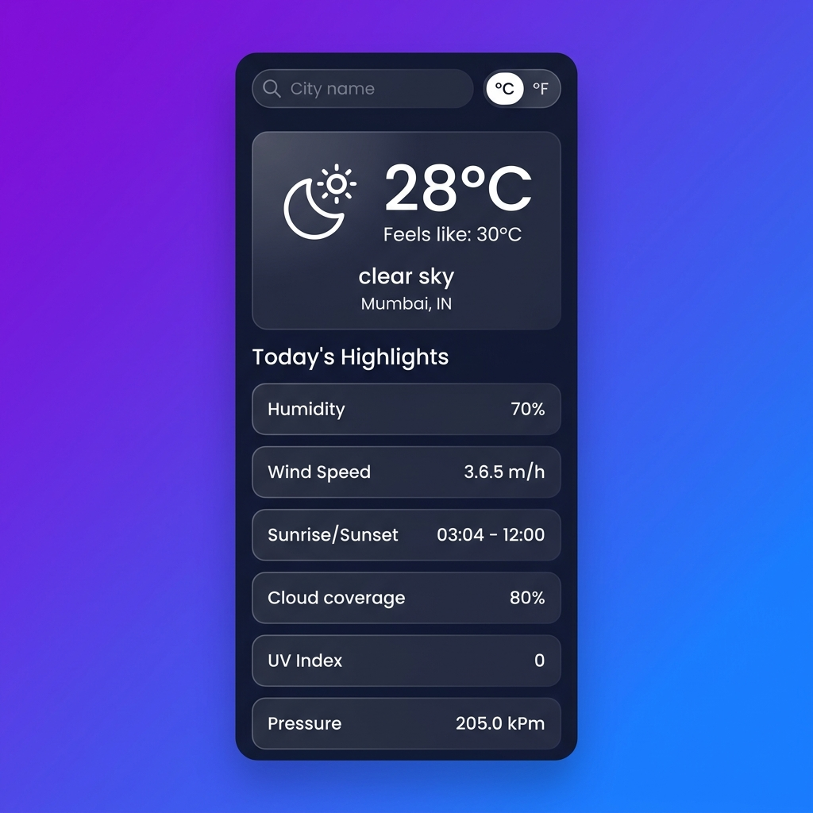

# 🌤️ Weather Application

A beautiful, modern weather application built with **React** that provides real-time weather data and forecasts using the OpenWeatherMap API. Features a stunning glassmorphism UI design with a vibrant purple-to-blue gradient background.

---

## 📸 Screenshots

### Main Dashboard


### 7-Day Forecast


### Mobile Responsive View


---

## ✨ Features

- 🔍 **City Search** — Search weather data for any city worldwide
- 🌡️ **Temperature Conversion** — Toggle between Celsius (°C) and Fahrenheit (°F)
- 📊 **Today's Highlights** — Humidity, Wind Speed, Sunrise/Sunset, Cloud Coverage, UV Index, and Pressure
- 📅 **7-Day Forecast** — View daily weather forecasts with icons and temperature ranges
- 🎨 **Glassmorphism Design** — Modern frosted-glass UI with backdrop blur effects
- 📱 **Responsive Layout** — Fully responsive design that adapts to all screen sizes
- ⚡ **Real-Time Data** — Powered by OpenWeatherMap API for accurate, live weather information

---

## 🛠️ Tech Stack

| Technology | Purpose |
|---|---|
| **React 19** | Frontend framework |
| **CSS3** | Styling with glassmorphism & animations |
| **OpenWeatherMap API** | Weather data provider |
| **Poppins Font** | Typography via Google Fonts |
| **Font Awesome** | Icon library |

---

## 🚀 Getting Started

### Prerequisites

- **Node.js** (v16 or higher)
- **Yarn** or **npm** package manager
- An **OpenWeatherMap API Key** — [Get one here](https://openweathermap.org/api)

### Installation

1. **Clone the repository**
   ```bash
   git clone https://github.com/your-username/Weather-Application.git
   cd Weather-Application
   ```

2. **Install dependencies**
   ```bash
   yarn install
   # or
   npm install
   ```

3. **Set up environment variables**

   Create a `.env` file in the root directory:
   ```env
   REACT_APP_WEATHER_API_KEY=your_openweathermap_api_key_here
   ```

4. **Start the development server**
   ```bash
   yarn start
   # or
   npm start
   ```

5. Open [http://localhost:3000](http://localhost:3000) in your browser.

---

## 📁 Project Structure

```
Weather-Application/
├── public/
│   ├── Screenshots/
│   │   ├── weather_app_main.png
│   │   ├── weather_app_forecast.png
│   │   └── weather_app_mobile.png
│   ├── index.html
│   ├── favicon.ico
│   └── manifest.json
├── src/
│   ├── App.js              # Root component
│   ├── App.css             # App-level styles
│   ├── WeatherApp.js       # Main weather component
│   ├── WeatherApp.css      # Weather component styles
│   ├── index.js            # Entry point
│   └── index.css           # Global styles & layout
├── .env                    # API key (not committed)
├── .gitignore
├── package.json
├── yarn.lock
└── README.md
```

---

## 📜 Available Scripts

| Command | Description |
|---|---|
| `yarn start` | Runs the app in development mode on [localhost:3000](http://localhost:3000) |
| `yarn build` | Builds the app for production to the `build` folder |
| `yarn test` | Launches the test runner in interactive watch mode |
| `yarn eject` | Ejects from Create React App (irreversible) |

---

## 🌐 API Reference

This app uses two OpenWeatherMap endpoints:

| Endpoint | Purpose |
|---|---|
| `/data/2.5/weather` | Get coordinates and basic weather for a city |
| `/data/3.0/onecall` | Get detailed current weather + 7-day forecast |

> **Note:** The One Call API 3.0 requires a subscription. Check [OpenWeatherMap pricing](https://openweathermap.org/price) for details.

---

## 🎨 Design Highlights

- **Glassmorphism** — Semi-transparent panels with backdrop blur for a modern frosted-glass effect
- **Gradient Background** — Smooth purple-to-blue gradient (`#6a11cb` → `#2575fc`)
- **Hover Animations** — Cards scale up on hover with smooth transitions
- **Custom Scrollbar** — Styled scrollbar matching the overall theme
- **Responsive Breakpoints** — Optimized layouts for desktop (>768px), tablet, and mobile (<480px)

---

## 🤝 Contributing

Contributions are welcome! Feel free to:

1. Fork the repository
2. Create a feature branch (`git checkout -b feature/amazing-feature`)
3. Commit your changes (`git commit -m 'Add amazing feature'`)
4. Push to the branch (`git push origin feature/amazing-feature`)
5. Open a Pull Request

---

## 📄 License

This project is open source and available under the [MIT License](LICENSE).

---

<p align="center">
  Made with React & OpenWeatherMap API
</p>
